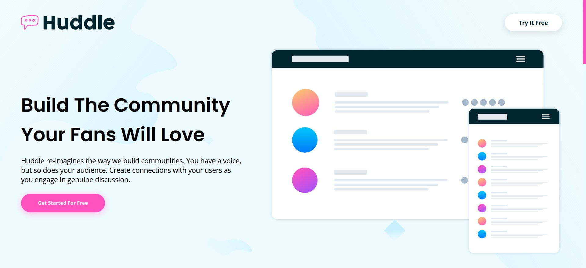

# Frontend Mentor - Huddle landing page with alternating feature blocks solution

This is a solution to the [Huddle landing page with alternating feature blocks challenge on Frontend Mentor](https://www.frontendmentor.io/challenges/huddle-landing-page-with-alternating-feature-blocks-5ca5f5981e82137ec91a5100). Frontend Mentor challenges help you improve your coding skills by building realistic projects.

## Table of contents

- [Overview](#overview)
  - [The challenge](#the-challenge)
  - [Screenshot](#screenshot)
  - [Links](#links)
- [My process](#my-process)
  - [Built with](#built-with)
  - [What I learned](#what-i-learned)
- [Author](#author)

## Overview

### The challenge

Users should be able to:

- View the optimal layout for the site depending on their device's screen size
- See hover states for all interactive elements on the page

### Screenshot

### Links

- Solution URL: [Solution](https://www.frontendmentor.io/solutions/responsive-huddle-website-with-alternating-feature-cards-_v2yf9INE)
- Live Site URL: [Live Site](https://huddlewebsite.netlify.app/)

## My process

This is my second junior challenge from Frontend Mentor and I am so proud of myself. I learned so much throw this project and I will continue doing junior challenges. I would like to do all the rest junior challenges and then to start with intermediate.

### Built with

- Semantic HTML5 markup
- CSS custom properties
- Flexbox

### What I learned

I learned a lot of things with this challenge.

- How to properly use semantic elements and what is the point of using it
- Why should I avoid setting height on divs
- Using width/max-width
- VW and VH units
- I made a custom scrollbar by myself
- Learned pseudo element ::selection
- Learned more about pseudo classes like :not and :last-child

- Custom scrollbar

html {
scrollbar-width: thin;
scrollbar-color: var(--pink) var(--pale-cyan);
}

html::-webkit-scrollbar-thumb {
background-color: var(--pink);
}

html::-webkit-scrollbar-track {
background-color: var(--pale-cyan);
}

- ::selection

h1::selection {
background-color: var(--dark-cyan);
color: var(--pale-cyan);
}

h2::selection {
background-color: var(--dark-cyan);
color: var(--pale-cyan);
}

h3::selection {
background-color: var(--dark-cyan);
color: var(--pale-cyan);
}

p::selection {
background-color: var(--pink);
color: var(--pale-cyan);
}

a::selection {
background-color: var(--pink);
color: var(--pale-cyan);
}

- Mixing :not and :last-child

.features .card:not(:last-child) {
margin-bottom: 2.8rem;
}

.card .card-text:not(.second-card) {
padding-left: 5rem;
margin-left: 5rem;
padding-right: 1rem;
}

## Author

- Frontend Mentor - [@dusanlukic404](https://www.frontendmentor.io/profile/dusanlukic404)
- LinkedIn - [@dusan-lukic](https://www.linkedin.com/in/dusan-lukic)
